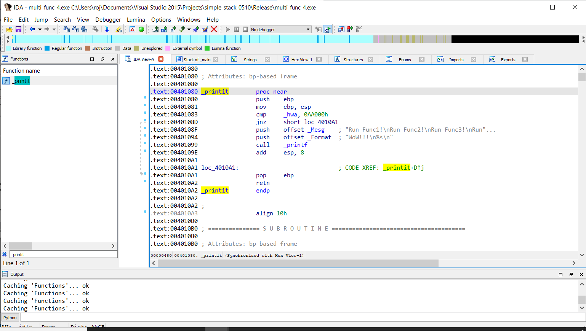
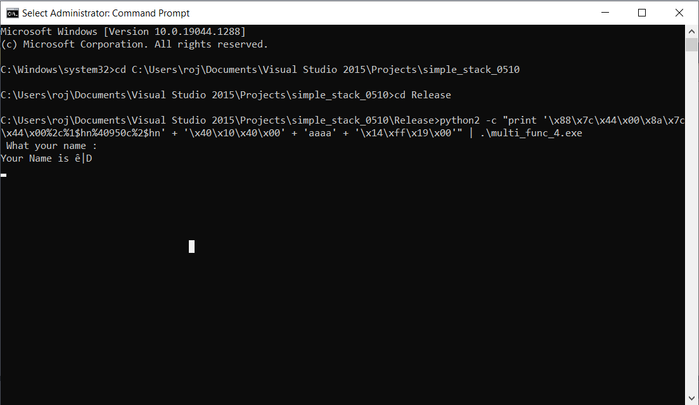
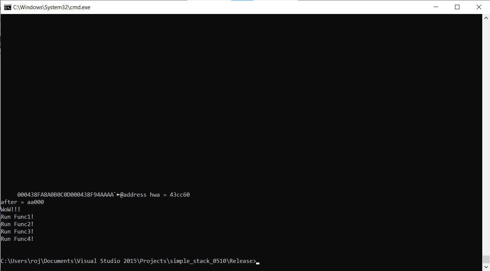

# Multi Function Call 4

### Question

- printit()함수를 실행하여 아래와 같은 출력 결과가 되도록 실행

```
Run Func1!
Run Func2!
Run Func3!
Run Func4!
WoW!!

```

```
#define MAX 49
#define BUFFER_SIZE 20
char Mesg[]="Run Func1!\\n"
           "Run Func2!\\n"
           "Run Func3!\\n"
           "Run Func4!\\n";
unsigned int hwa;
void printit()
{ 
     if (hwa == 0x000aa000)
         printf("WoW!!!\\n%s\\n", Mesg); 
}int main(int argc,char *argv[])
{ 
     char buf1[BUFFER_SIZE];
     hwa = 0xa0b0c0d0;
    
     printf(" What your name : ");
     fgets(buf1, MAX, stdin);
     printf("\\nYour Name is %s\\n", buf1);
}

```


<br>

 

### Analysis

**1)**

```
memcpy(&hwa, buf1, 4); 
printit;
```

- 위의 코드가 시행되도록 payload 구성




- python에서 '\x00\xa0\x0a\x00'를 입력받을때, '\x0a'를 '\n'으로 치환하여 받아들여서 입력값 오류 발생


- 입력값을 '\x00\xb0\x0b\x00'으로 바꿔서 시도하니 printit 함수를 정상적으로 방문하는 것 확인
    - 출력 순서 바뀌어야 함


<br>

**2) hwaa의 주소에 000a a000을 %hn으로 나눠서 씌우기**

hwaa : 0x00447c88


0x00447c88 00	a000

0x00447c89 a0

0x00447c8a 0a	000a

0x00447c8b 00


4

4

2 (10 - 8)

0

40950 (40960 - 10)

0





<br>

**3)**

```
#include <windows.h>
#include <stdio.h>
#define MAX 4096
#define BUFFER_SIZE 4096
char Mesg[] = "Run Func1!\\n"
"Run Func2!\\n"
"Run Func3!\\n"
"Run Func4!\\n";
unsigned int hwa;
void printit()
{
	if (hwa == 0x000aa000)
		printf("WoW!!!\\n%s\\n", Mesg);
}int main(int argc, char *argv[])
{
	char buf1[BUFFER_SIZE];
	hwa = 0xa0b0c0d0;
	printf(" What your name : ");
	fgets(buf1, MAX, stdin);
	printf("\\nYour Name is %s\\n", buf1);
	printf("address hwa = %x\\n", &hwa);
	printf("before= %x\\n", hwa);
	_set_printf_count_output(1);
	printf(buf1);
	printf("address hwa = %x\\n", &hwa);
	printf("after = %x\\n", hwa);
}

```


- 다른 점?


- build 할때 최적화(Optimization) 옵션 On/Off의 차이


-  hwa = 0x000aa000 : 성공

```
#define MAX 49
#define BUFFER_SIZE 20
```





- 00438f60 : WoW!!!

- 0043b8c0 : Mesg 변수

​	=> 순서를 어떻게 바꿀 수 있을까? Stack BOF 이용해야 할 것 같음

<br>

- 0x00401030 printf : 함수 위치 뒤에 RET 주소가 저장됨

- 0x00401076 : 함수 위치 뒤에 바로 인자가 저장됨


- printf의 %s에 null을 넣음

  - hwa 변수 주소 : 0x0043cc60

  - Mesg 변수 주소 : 0x0043b8c0
      - 0x0043b8ec가 null


<br>

**4) SEH**


<br>


### Reference

- [https://m.blog.naver.com/errorsoft666/222298173502](https://m.blog.naver.com/errorsoft666/222298173502)
- [https://brwook.github.io/posts/format-string-bug/](https://brwook.github.io/posts/format-string-bug/)
